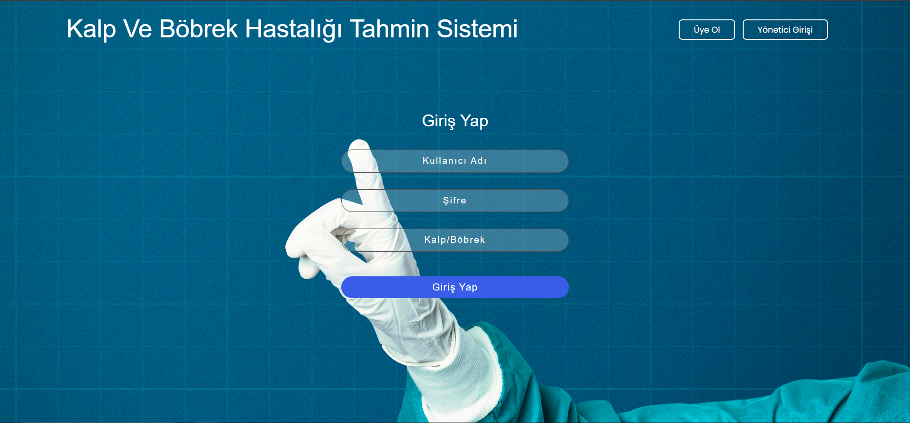
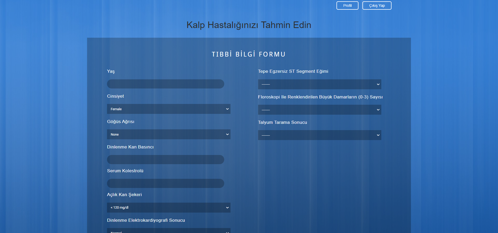

# Kalp Ve Böbrek Hastalığı Tahmin Sistemi

>Bu projenin amacı, veri madenciliği teknikleri ve makine öğrenme algoritmalarını kullanarak kalp ve Böbrek hastalıklarını tahmin etmektir. Bu proje, scikit-learn kullanılarak 6 sınıflandırma modeli uygulanmıştır: Lojistik Regresyon, Naïve Bayes, Destek Vektör Sınıflandırıcı, KNN, Sinir Ağı ve Karar Ağacı Modeli. UCI veri deposundan ve Kaggle.com'dan elde edilen kalp ve böbrek hastalığı veri setleri üzerindeki performansları araştırılmıştır.

Aşağıdaki özellikleri destekler:

*   Giriş/Yeni Kayıt
*   Profili Görüntüleme ve Düzenleme
*   Kullanıcı, risk faktörünün makine öğrenimi algoritmaları kullanılarak hesaplanması için çeşitli parametrelerin değerlerini girebilir.

 
 

  
 

 
 
 

  
 

Quick start
-----------
1. docker compose up (Bu komut ile Docker kullanılarak projeyi hızlıca başlatabilirsiniz.)